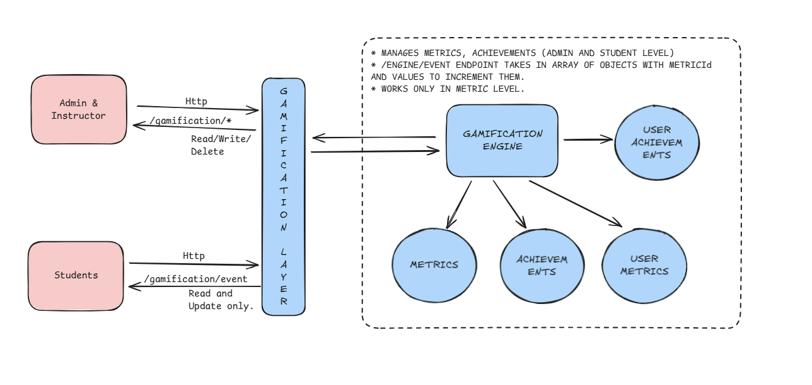

# 📘 Concepts

Before integrating or configuring the **Gamification Submodule**, it's important to understand a few foundational concepts. These provide the mental model needed to work effectively with the system.

## Component Breakdown

The gamification submodule is split into two parts: the **Gamification Engine** and the **Gamification Layer**. This separation makes it easier and more flexible to manage gamification in your app.

### Gamification Engine

The core component of the gamification system that tracks user metrics and triggers achievements to boost engagement.  
Think of it as the _“scorekeeper”_ that monitors user activity and rewards them when they hit specific milestones.

When a user completes a task or reaches a goal, the engine recognizes the achievement and assigns the appropriate reward.

The Gamification Engine manages:

- **Metrics**: Tracks user actions and progress.
- **Achievements**: Assigns rewards based on milestones and goals.

It operates at both the **user** and **admin** levels, ensuring that both users and administrators can interact with and manage the gamification experience.

### Gamification Layer

The Gamification Layer acts as an abstraction over the Gamification Engine, providing enhanced functionalities.  
It allows you to define events and associate rules in an API-first manner, making it easier to integrate and manage gamification features across the application.

This layer provides:

- A flexible way to define and customize events.
- Easy rule association for triggering achievements.
- An API-first approach for better scalability and integration with external systems.

It simplifies the interaction with the core gamification engine and ensures that you can easily extend or modify gamification features as needed.

**_It’s crucial to understand when to use each component to implement gamification effectively. As a general rule, if your gamification logic involves complex rules or relies on external data, use the Gamification Layer._**
